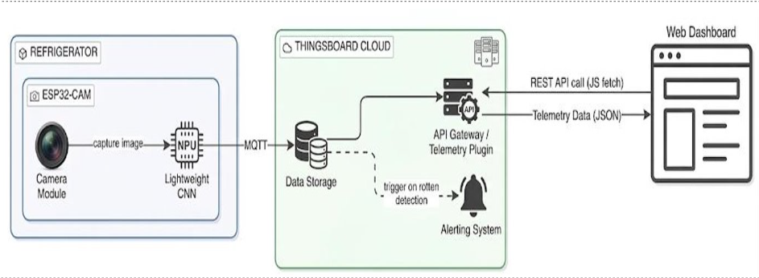
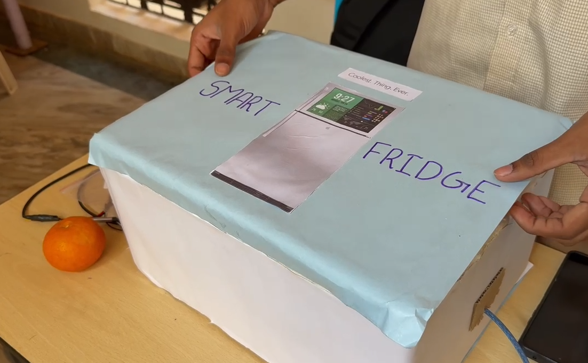
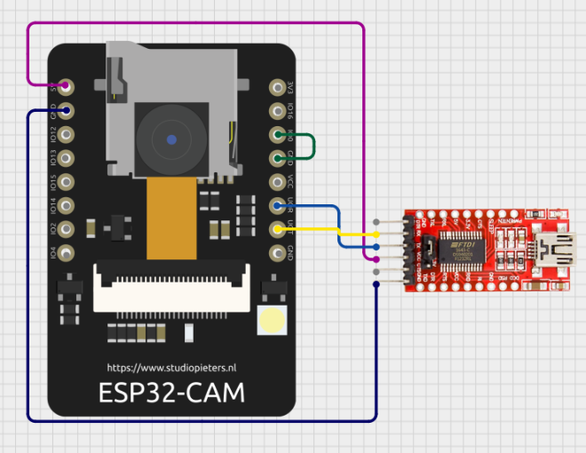
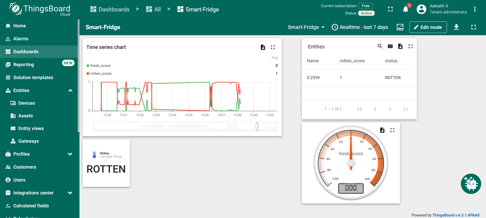
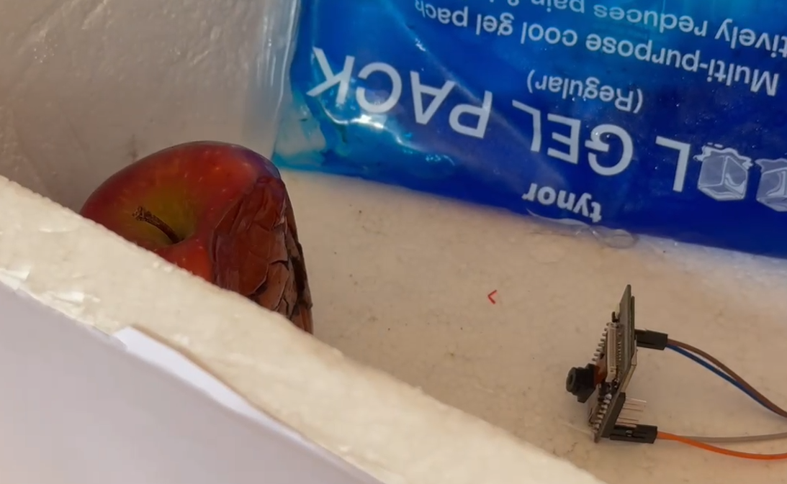

  

<h1 align="center">Smart Fridge</h1>

  <strong>AI-powered fruit freshness detection for a smarter refrigerator</strong>

This project combines embedded AI, computer vision, and IoT monitoring to detect whether fruit stored inside a refrigerator is fresh or rotten. The system uses an ESP32-CAM module running a compact Edge Impulse model for on-device inference and reports results through ThingsBoard and a companion web dashboard.

## Architecture Diagram

  

## Overview
- Detect fresh and rotten fruit using a CNN model deployed on ESP32-CAM
- Stream the camera view and monitor results remotely
- Publish inference results to ThingsBoard and log them locally for debugging

## Public Dataset
The model was trained using the public dataset available at:
https://www.kaggle.com/datasets/sriramr/fruits-fresh-and-rotten-for-classification

## System Architecture
The workflow is simple and reliable:
1. The ESP32-CAM captures an image of the fruit inside the fridge.
2. The trained Edge Impulse model runs locally on the device.
3. The inference result is displayed in the serial monitor and sent to the dashboard.

## Hardware Components

| Component | Purpose |
|----------|---------|
| ESP32-CAM (AI-Thinker) | Main processing unit and camera module |
| USB-to-TTL Adapter | Firmware upload and serial debugging |
| Jumper Wires | Interconnections between modules |
| Flash LED | Visual indication during image capture and inference |

## Model and Training
The trained model was exported as an Arduino-compatible library from Edge Impulse.

### Model Details
- Image preprocessing and resizing
- Binary classification between fresh and rotten fruit
- CNN architecture optimized for embedded deployment
- Quantized model suitable for ESP32-CAM inference

### Training Performance

| Metric | Value |
|--------|-------|
| Validation Accuracy | ~96% |
| Test Accuracy | ~94.6% |
| Model Type | CNN |
| Quantization | int8 |

## Firmware and Deployment
The main firmware sketch is available at [esp32/esp32_cam_rotten_fruit.ino](esp32/esp32_cam_rotten_fruit.ino).

### Deployment Steps
- Export the trained model from Edge Impulse as an Arduino library.
- Add the library to Arduino IDE.
- Open the firmware sketch and update the Wi-Fi and ThingsBoard credentials.
- Upload the firmware to the ESP32-CAM board and power it on.

## Monitoring and Dashboard
The project includes both device-level and cloud-based monitoring interfaces.

- ThingsBoard dashboard for telemetry and status updates
- Companion website for a user-friendly monitoring view

 

## Installation View
The internal setup was also documented to show the practical placement of the camera and hardware inside the fridge.

## Debugging and Serial Monitoring
Serial output is used for live inference results and system diagnostics during testing and deployment.

## Repository Structure
- [esp32](esp32/) – ESP32 firmware and Arduino sketch
- [edge-impulse-model](edge-impulse-model/) – exported Edge Impulse model assets
- [images](images/) – project images and documentation visuals
- [docs](docs/) – supporting documentation

## Future Work
- Extend the model to more fruit and vegetable categories
- Add temperature and gas sensing for richer environmental monitoring
- Improve robustness using more real-world fridge images

## License
This project is distributed under the MIT License.
